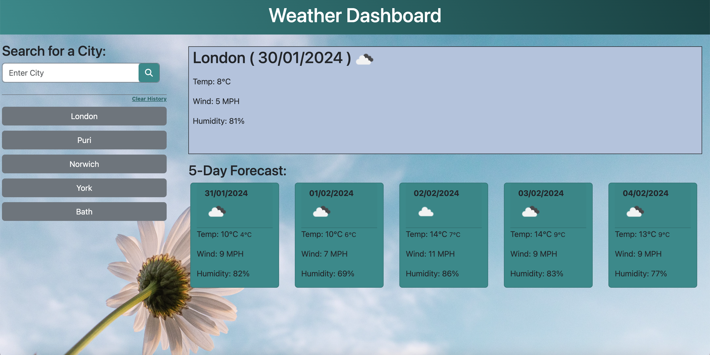

# Weather Dashboard
5 day weather forecast of city entered

## Description

The aim of this project was to create a weather dashboard that fetches weather data from server side APIs using https://openweathermap.org.\ For the purpose of our app, the latittude and longitude of the city entered was fetched using the geocoding API and then this information was used as query parameters for the current weather and the 5-day forecast API. \
Data was fetched through the fetch API with an understanding of asynchronous functions and promises. JQeury and Day.js was used to extract specific information from the data received and to display the required weather data. Temperature was fetched and displayed in °C and wind speed was converted to miles per hour as per the standard usage across the UK. Local storage was used to save and show the search history.\
The application features dynamically updated HTML and CSS Bootstrap powered through javascript and javascript libraries.\
Version control was through git and the updated repository can be found at:

https://github.com/ShaliniSunkuru/weather-dashboard 

## Table of Contents

- [User Story](#user-story)
- [Acceptance Critera](#acceptance-criteria)
- [Screenshot](#screenshot)
- [Technology Used](#technology-used)
- [Deployment](#deployment)
- [Usage](#usage)
- [Credits](#credits)
- [License](#license)

## User Story

AS a traveller\
I WANT to see the weather outlook for multiple cities\
SO THAT I can plan a trip accordingly.

## Acceptance Criteria

GIVEN a weather dashboard application\
WHEN I open the application in the browser\
I see a form input to search city\
WHEN I type in the name of a city and click on search button\
I see the day's weather information including:\
    - The city name\
    - The date\
    - An icon representation of weather conditions\
    - The temperature\
    - The humidity\
    - The wind speed\
I also see the 5-day weather forecast of the city displaying:\
    - The date\
    - An icon representation of weather conditions\
    - The temperature (maximum and minumum for the day)\
    - The wind speed (average)\
    - The humidity (average)\
WHEN I search for a city\
I can see a button created with the city name\
WHEN I click on city button\
The current and forecast weather for that city is displayed\
WHEN I refresh or reload the application\
The weather information of the latest search city is displayed\
WHEN I click on the Clear history button\
The city buttons are cleared\
WHEN I enter a non-existent cit\
I am alerted with an error message

## Screenshot

Here is a screenshot of the application in a browser with some text added and saved on the page.

## Technology Used

The following tools and technologies were used in this project

- HTML5
- CSS
- Bootstrap
- Javascript
- JQuery
- Day.js
- Server APIs 
- fetch API
- Visual Studio Code
- GIT
- Github
  
## Deployment

Here is a link to the deployed project.

https://shalinisunkuru.github.io/weather-dashboard/

## Usage

Click on the url for the deployed project.\ 
Enter a city in the input box and click search\
The weather data is displayed on the right\
City button is saved for future views\
Enter more cities to see their weather information.\
Try entering non-existent city names\
Note the error\
Click on a city button\
Note the plcement of the button change to the top\
See the weather displayed\
Reload the page to see your saved searches!\

## Credits

I appreciate the guidance of the instrutor and TAs of edX Bootcamp for helping us understand the complex working of server side APIs. My peers at the bootcamp have been a motivation in helping me push through the challenges faced while working on this project. W3Schools, MDN Documentation, and stack overflow have been a great help in grasping the concepts of javascript. I also learnt how to use the documnetaion of the APIs.

## License

Please refer to the MIT License in the repository.

